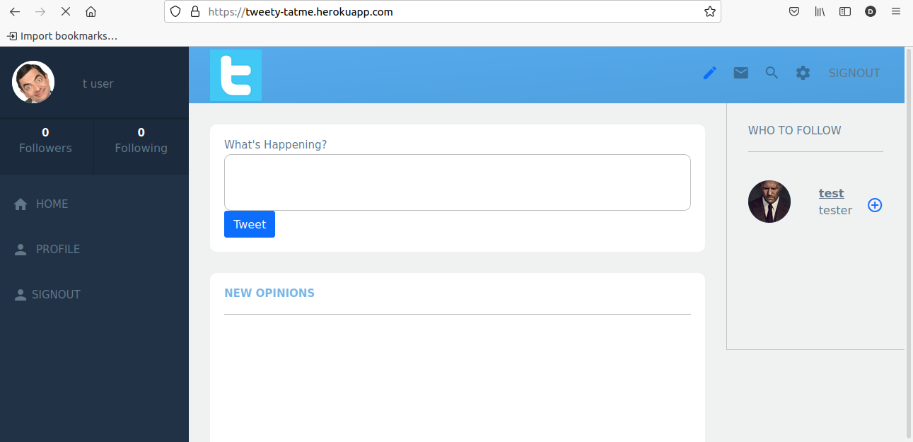

# The TaTme

## Table of Contents
  <br />

* [About the Project](#about-the-project)
* [Built With](#built-with)
* [Contributing](#contributing)
* [Contact](#authors)
* [Acknowledgements](#acknowledgements) 
* [Getting Started](#getting-started) 
* [Live Demo and Video](#live-demo) 

#
<br />


<br />

### Built With

* [RUBY]
* [RAILS]
* [DEVISE]
* [RSPEC&CAPIBARA]
* [BOOTSTRAP]
* [CLOUDINARY]
* [POSTGRESQL]


<!-- ABOUT THE PROJECT   -->
## About The Project

The TaTme project sets up an that allows you to share your opinions related to daily, political, business, or life wealth hacks that you have used in the past. As well we welcome all sort of insights, opinions, Forecast or interpretations of current policy, life, and world news

## Screenshot Test

## User page
<p align="center">
  
</p>

## Edit User
<p align="center">
  
</p>

## Live Demo

- [Live Demo Link]()

- [Video]()

## Contributing

Contributions make the open-source community such an amazing place to learn, inspire, and create. Any contributions you make are **greatly appreciated**.

## Prequisites

Ruby & Rails installed on your local machine.
Bundle installed on your machine
Terminal or similar to execute the program.


## Getting Started


## Clone project

- To get a local copy up and running follow these simple example steps.
- Clone this repository with git clone ```https://github.com/elyor-doniyorov/Rails-Cap-Twitter.git``` using your terminal or command line.
- Change to the project directory by entering: ```cd workspace``` in the terminal.

## How to use the Private-Event app
1. run the command ```bundle install```   This will install the required dependencies
2. run the command ```rails webpacker:install ``` This will install the webpack to avoid specific rails => 6 problems
3. run the command ```rails db:create``` This will initialize the necessary migration files
4. run the command ```rails db:migrate``` 
5. run the command ```rails server```

## Command line steps
```
- $ git clone `$ git clone https://github.com/elyor-doniyorov/Rails-Cap-Twitter.git`
- $ git checkout workspace
- $ cd tatme`
- $ bundle 
- $ rails webpacker:install 
- $ rails db:create
- $ rails db:migrate
- $ rails server
```

## Testing
In this project, the testing was done using RSpec to test logic specs.

## Install
- In a terminal window type gem install RSpec
- Once RSpec install has finished, type RSpec --init
- You will see a folder spec and a file .rspec
- Inside spec folder, you'll see a spec_helper.rb file.

## Run
The testing files are included in spec folders.
- Inside your terminal type: rspec spec/*
- Type rspec spec/* to run all tests
 
- All test should pass

## Command line Rspec steps
```
- $ gem install rspec
- $ rspec spec/*
- $ 29 examples, 0 failures

```

<p align="center">
  
</p>

## Authors

👤 Elyor Doniyorov

- Github: [@elyor-doniyorov](https://github.com/elyor-doniyorov)
- LinkedIn: [@elyor-doniyorov](www.linkedin.com/in/elyor-doniyorov)


<!-- ACKNOWLEDGEMENTS -->
## Acknowledgements

* [Microverse](https://www.microverse.org/)
* Design idea by [Gregoire Vella on Behance](https://www.behance.net/gregoirevella)


## 📝 License

This project is [MIT](licence) licensed.